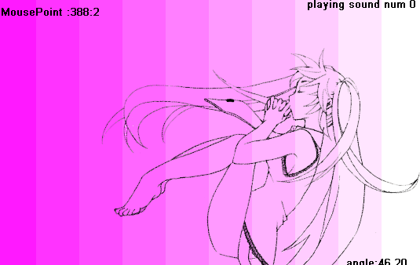
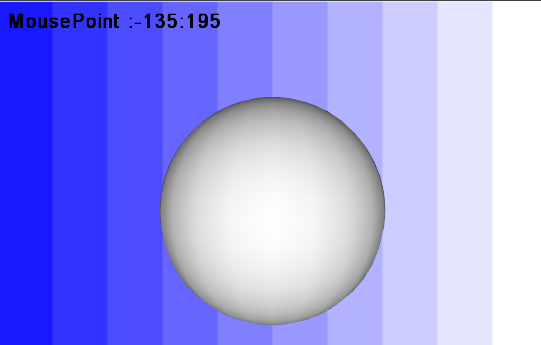
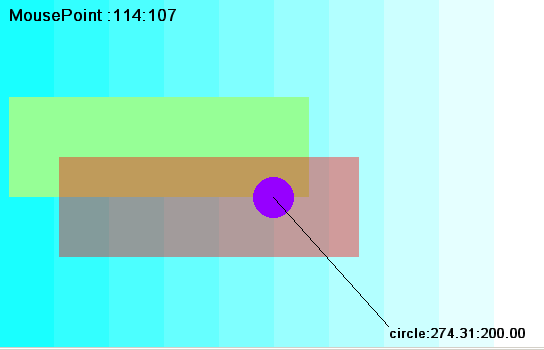

# DXライブラリ for LuaJIT

DXライブラリをLuaJITで使うためのffiバインディングです。

中身はほぼdxライブラリの.hファイルのコピペです。 ←重要

## DXライブラリ

ＤＸライブラリ置き場 (本家様)
(http://homepage2.nifty.com/natupaji/DxLib/)

必要なファイルはVisualC# 用パッケージの``DxLib.dll``。

VisualC# 用パッケージ
http://homepage2.nifty.com/natupaji/DxLib/dxdload.html

## メモ

日本語の表示について

luaは標準でUTFとして文字を扱うらしくそのまま日本語を表示させようとすると文字化けするようです。
解決策として

* 文字コード変換のnkfを使う。

lua-nkf-naitve ( https://github.com/hnakamur/lua-nkf-native )

* lua用icuライブラリを使う。

icu-lua ( http://luaforge.net/projects/icu-lua/ )

## note
LuaJIT、DXライブラリ本家様、リンク先の開発者様に重ねて感謝です。

LuaJIT ( http://luajit.org/ )

## example

example02.lua

example03.lua

example01.lua

