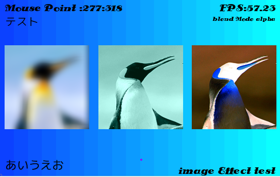
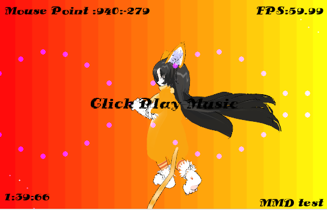
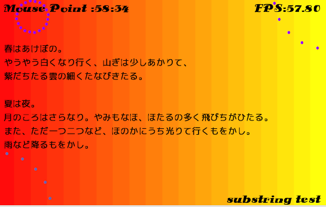

# DXライブラリ for LuaJIT

DXライブラリをLuaJITで使うためのffiバインディングです。 
中身はほぼdxライブラリの.hファイルのコピペです。 

## DXライブラリ

* ＤＸライブラリ置き場 (本家様)(http://homepage2.nifty.com/natupaji/DxLib/)
* VisualC# 用パッケージ http://homepage2.nifty.com/natupaji/DxLib/dxdload.html

※ 必要なファイルはVisualC# 用パッケージの``DxLib.dll``。

## note
LuaJIT、DXライブラリ本家様、リンク先の開発者様に重ねて感謝です。 
LuaJIT ( http://luajit.org/ )

## exampleで使った素材。

* pmd モデル:VPVP wikiより「ちび謎生物」きなこさん:(http://www6.atwiki.jp/vpvpwiki/pages/448.html)
* vmdアニメーション:もみじもーしょん詰め合わせ(http://www.nicovideo.jp/watch/sm14987400)
* フォント:ds_siena_black (http://www.1001freefonts.com/ds_siena_black.font)

※ Dxライブラリ付属のDxLibModelViewerでDxライブラリ独自形式のmv1に変換して使っています。

## example

