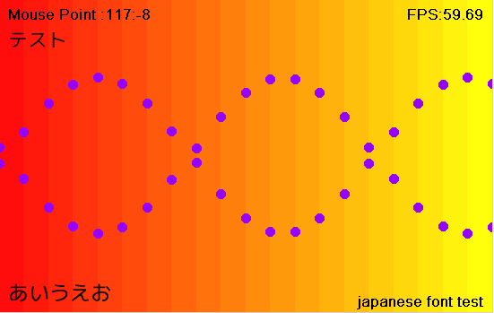

# DXライブラリ for LuaJIT

DXライブラリをLuaJITで使うためのffiバインディングです。

中身はほぼdxライブラリの.hファイルのコピペです。 ←重要

## DXライブラリ

ＤＸライブラリ置き場 (本家様)
(http://homepage2.nifty.com/natupaji/DxLib/)

必要なファイルはVisualC# 用パッケージの``DxLib.dll``。

VisualC# 用パッケージ
http://homepage2.nifty.com/natupaji/DxLib/dxdload.html

## note
LuaJIT、DXライブラリ本家様、リンク先の開発者様に重ねて感謝です。

LuaJIT ( http://luajit.org/ )

## example

